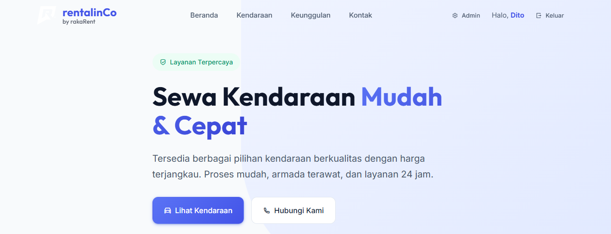

# rentalinCo - Vehicle Rental Management System

**rentalinCo** adalah aplikasi manajemen penyewaan kendaraan berbasis web yang dirancang untuk memberikan solusi digital yang efisien, modern, dan mudah digunakan bagi bisnis rental.

Aplikasi ini menggabungkan keandalan backend PHP & MySQL dengan antarmuka pengguna (UI) yang estetis dan responsif, menjadikan proses pencatatan transaksi, pengelolaan armada, dan pemantauan pelanggan lebih terstruktur dan profesional.

## Tentang Proyek Ini

Sistem ini dibuat untuk menjawab kebutuhan operasional bisnis rental kendaraan, meliputi:
*   **Pencatatan Otomatis**: Menghindari kesalahan pencatatan manual.
*   **Manajemen Aset**: Memantau ketersediaan dan status setiap unit kendaraan secara real-time.
*   **Kalkulasi Akurat**: Perhitungan biaya sewa, durasi, dan denda keterlambatan secara otomatis.
*   **Pengalaman Pengguna**: Desain antarmuka yang intuitif dengan sentuhan estetika modern (Glassmorphism & Smooth Animations).

## Fitur Unggulan

*   **Dashboard Informatif**: Ringkasan status armada dan transaksi aktif.
*   **Sirkulasi Kendaraan**: Fitur Peminjaman (Rental) dan Pengembalian (Return) yang terintegrasi.
*   **Manajemen Database**: CRUD (Create, Read, Update, Delete) untuk data Pelanggan dan Kendaraan.
*   **Laporan Keuangan**: Rekapitulasi pendapatan dari transaksi yang selesai.
*   **Keamanan**: Sistem login administrator untuk membatasi akses data sensitif.

## Teknologi yang Digunakan

*   **Backend**: PHP Native (Terstruktur & Efisien)
*   **Database**: MySQL
*   **Frontend**: HTML5, Modern CSS (Custom Design, No Framework dependencies), JavaScript
*   **Desain**: Responsif & Premium UI

## Profil

**[Muhammad Rizky Raka Pratama]**  
312210397  
Teknik Informatika  
Universitas Pelita Bangsa  

---
© 2026 rentalinCo. All Rights Reserved.
